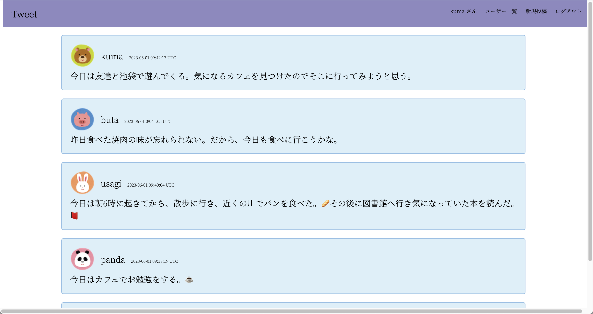
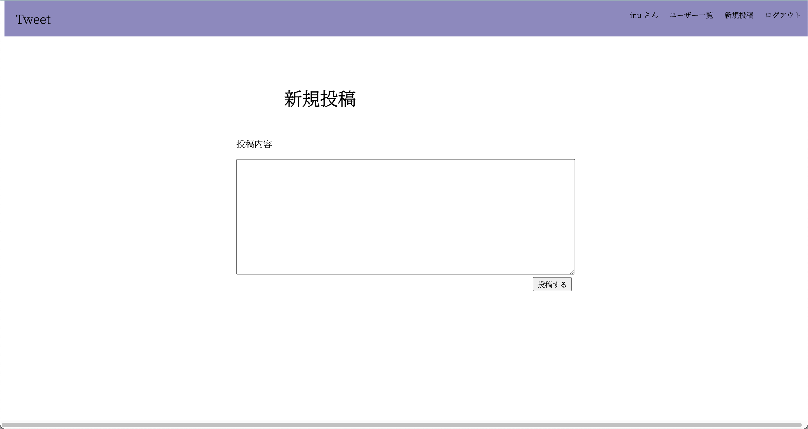
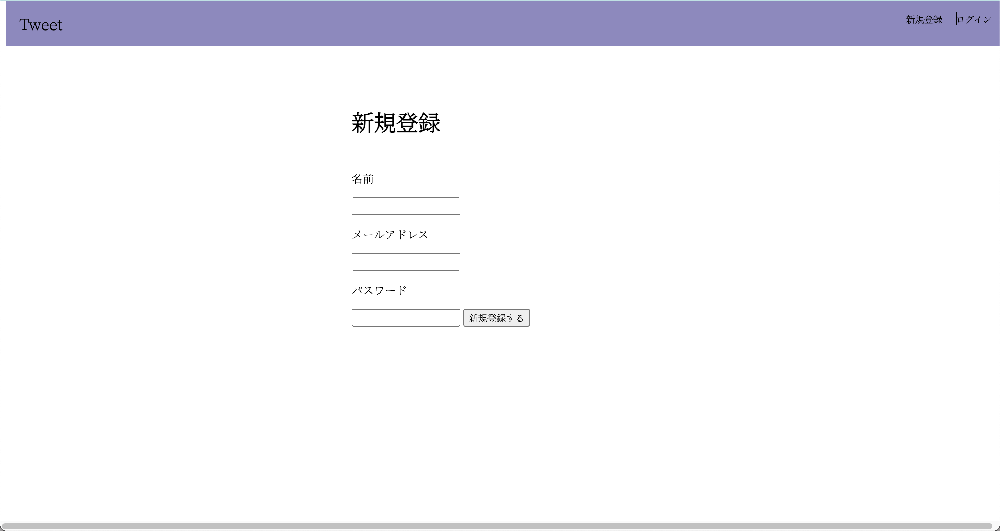
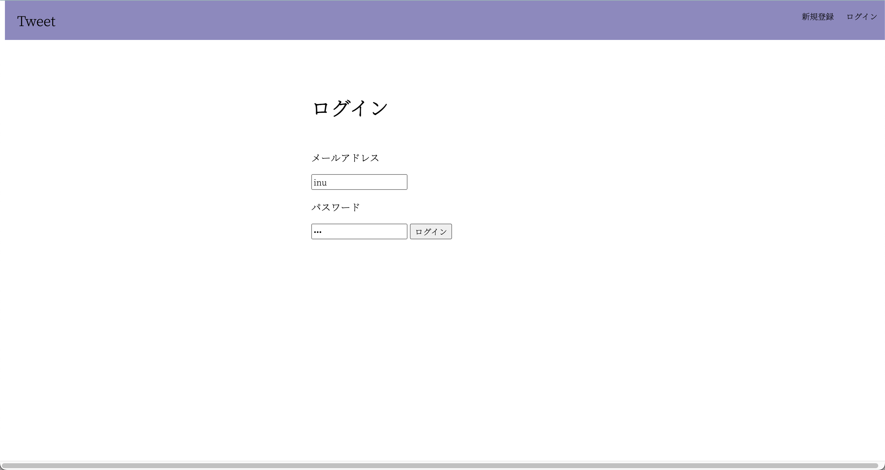

<h1>Tweet app</h1>
Tweet appは、日常的な出来事を投稿するアプリです。新規登録、ログイン、ログアウト、新規投稿、投稿の編集と削除、ユーザー名とプロフィール画像とメールアドレスの編集を行う事ができる機能を有しています。また、before_actionで様々な機能を実装しているので、不正に他のユーザーの情報や投稿の編集を行えないような機能も実装しました。また、新規登録時のパスワードをデータベースへ登録する際に、ハッシュ化しているので、万が一データベースの情報が流出した場合でも安全であるようにしました。開発言語はRuby on Rails5です。

<h3>- 目次 -</h3>

- [Tweet-appの使い方](#tweet-appの使い方)
- [Tweet-appの始め方](#tweet-appの始め方)
  - [Railsアプリケーションの作成](#railsアプリケーションの作成)
  - [各種HTMLの内容](#各種htmlの内容)
  - [データベースの構造](#データベースの構造)

# Tweet-appの使い方
1. ホーム画面にはそれぞれのユーザーの投稿が閲覧できる。

2. 新規投稿
以下の画面で投稿したい内容を入力し、「投稿する」ボタンを押す。

3. 新規登録方法
以下の画面で必要事項を入力し、「新規登録する」ボタンを押す。

1. ログイン方法
以下の画面でメールアドレスとパスワードを入力する。


# Tweet-appの始め方
## Railsアプリケーションの作成
Railsアプリケーションを作成する
```
rails new tweet_app
```
サーバーを起動する
```
rails server
```
postsコントローラとindexアクションをコマンドにより作成する
```
rails generate controller posts index
```
usersコントローラとindexアクションをコマンドにより作成する
```
rails generate controller users index
```
モデルの作成
```
rails g model Post content:text user_id:integer
rails g model User name:string email:string password:string image_name:string
rails db:migrate
```

## 各種HTMLの内容
- posts
  - index.html.erb           (投稿一覧)
  - article.html.erb         (投稿の詳細)
  - edit.html.erb            (投稿の編集)
  - new_post_form.html.erb   (新規投稿)
- users
  - index.html.erb           (ユーザ一覧)
  - edit.html.erb            (ユーザー情報の編集)
  - login_form.html.erb      (ログインフォーム)
  - signup_form.html.erb     (新規登録)

## データベースの構造
1. Post

| カラム名   | データ型 | 説明                             |
| :--------: | :------: | :------------------------------: |
| id         | default  | id                               |
| content    | text     | 投稿内容                         |
| user_id    | integer  | 誰が投稿をしたのかを保存する変数 |
| created_at | default  |                                  |
| updated_at | default  |                                  |

2. User

| カラム名   | データ型 | 説明                     |
| :--------: | :------: | :----------------------: |
| id         | default  |                          |
| name       | string   | ユーザーの名前           |
| email      | string   | ユーザーのメールアドレス |
| password   | string   | ユーザのパスワード       |
| image_name | string   | ユーザー画像の名前       |
| created_at | default  |                          |
| updated_at | default  |                          |
